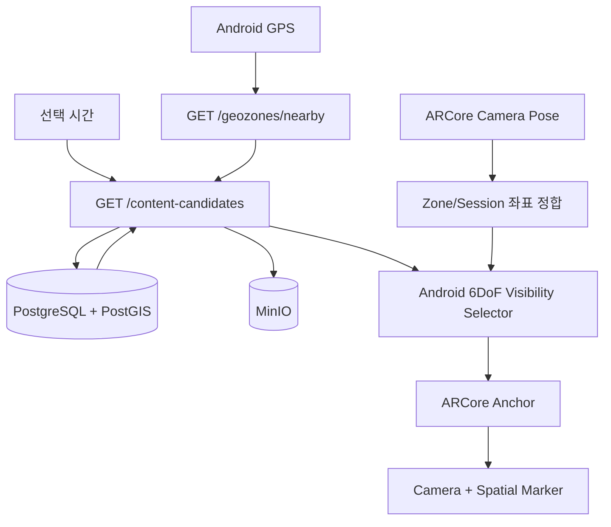

# Architecture

## 전체 흐름

## 책임 분리

Backend는 현재 위치와 선택 시간에 유효한 후보만 반환한다. 각 후보에는 콘텐츠 메타데이터와 `SpatialPlacement`가 포함된다. Android는 ARCore Pose를 같은 Zone-local 좌표계로 변환한 뒤 거리와 View Cone을 계산한다. 화면에 들어온 후보만 Anchor로 생성하고 렌더링한다.

`Moment`는 실제 장소와 기록 시간을 가진 Organic 콘텐츠다. `Campaign`은 `CampaignSchedule`의 시간 창과 priority를 가진 Commercial 콘텐츠다. 둘은 후보 응답 형태만 공유하며 저장과 활성화 규칙은 분리한다.

## 좌표계

DB의 `SpatialPlacement.local_x/y/z`는 GeoZone 원점을 기준으로 `+X 동쪽, +Y 위쪽, -Z 북쪽`인 Zone-local AR 좌표를 사용한다. ARCore Pose는 세션 로컬 좌표이므로 현장 Calibration 결과를 통해 이 좌표계로 변환해야 한다. 초기 앱은 변환 행렬이 Identity라고 가정하는 Demo 단계다.
