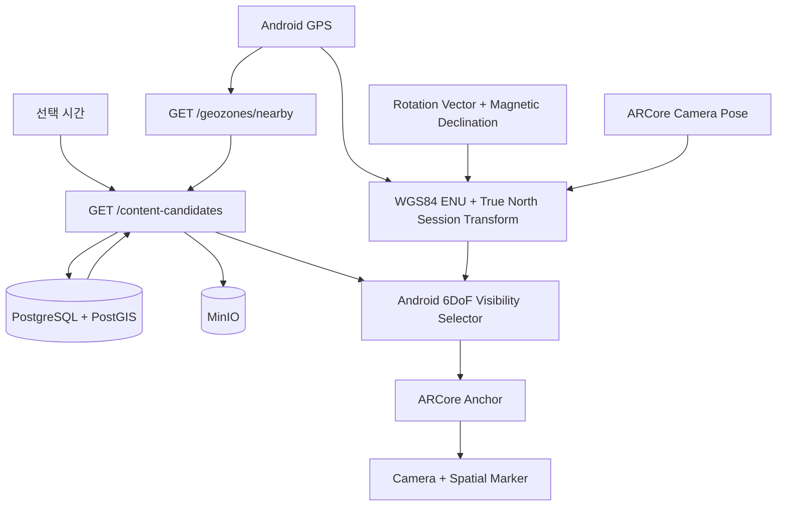

# Architecture

## 전체 흐름

## 책임 분리

Backend는 현재 위치와 선택 시간에 유효한 후보만 반환한다. 각 후보에는 콘텐츠 메타데이터와 `SpatialPlacement`가 포함된다. Android는 ARCore Pose를 같은 Zone-local 좌표계로 변환한 뒤 거리와 View Cone을 계산한다. 화면에 들어온 후보만 Anchor로 생성하고 렌더링한다.

`Moment`는 실제 장소와 기록 시간을 가진 Organic 콘텐츠다. `Campaign`은 `CampaignSchedule`의 시간 창과 priority를 가진 Commercial 콘텐츠다. 둘은 후보 응답 형태만 공유하며 저장과 활성화 규칙은 분리한다.

## 좌표계

DB의 `POI.location`은 WGS84 절대 위·경도이며 `SpatialPlacement.local_x/y/z`는 POI를 기준으로 `+X 동쪽, +Y 위쪽, -Z 북쪽`인 상대 좌표를 사용한다. Android는 Session 시작 시 Phone GPS, True North Heading과 ARCore Camera Pose를 한 번 결합한다. POI를 Phone 기준 ENU 미터 좌표로 변환한 뒤 POI 상대 배치를 더하고, 고정된 Transform으로 ARCore Session 좌표를 만든다. 이후 GPS·Compass 갱신은 Marker에 계속 적용하지 않고 ARCore 6DoF Tracking을 유지한다.

POI와 Phone 양쪽에 WGS84 타원체고가 있을 때만 수직 차이를 자동 적용한다. 국가 표고인 `orthometric_height_m`는 타원체고와 섞지 않고 지면·층고 보정을 위한 별도 기준으로 유지한다.
