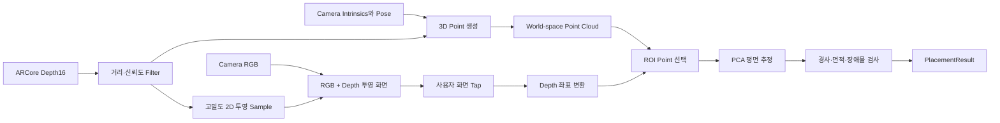

# 심도 기반 실시간 3D 공간 및 가구 배치 계산 정리

## 1. 목적과 현재 구현 범위

이 모듈은 Android 기기의 ARCore Depth를 이용해 카메라가 보는 공간을 실시간 3D point로 변환하고, 사용자가 누른 위치에 지정한 크기의 가구를 놓을 수 있는지 계산한다. 모든 계산은 기기 안에서 수행하며 Network 연결이나 Server가 필요하지 않다.

현재 구현은 방 전체를 영구적인 3D mesh로 복원하는 방식이 아니다. 매 Depth frame에서 world-space point cloud를 만들고, 터치 위치 주변의 국소 평면과 장애물을 계산하는 배치 판단 모듈이다.

## 2. 기본 원리

### 2.1 RGB 영상에 거리 정보를 더한다

일반 카메라의 RGB 영상은 물체의 색과 모양은 보여주지만, 카메라에서 물체까지의 실제 거리는 직접 알려주지 않는다. Depth image는 RGB 영상과 대응하는 각 pixel에 거리값을 기록한다. 예를 들어 한 pixel의 값이 `650mm`라면 그 방향의 표면이 카메라에서 약 `0.65m` 떨어져 있다는 뜻이다.

따라서 RGB와 Depth를 겹치면 “무엇이 보이는가”와 “얼마나 떨어져 있는가”를 한 화면에서 함께 판단할 수 있다.

### 2.2 거리 pixel을 3D 점으로 바꾼다

Depth의 한 pixel은 거리만 가지고 있으므로 그 자체로는 3D 위치가 아니다. 카메라의 초점거리와 중심점인 `CameraIntrinsics`를 이용해 pixel이 카메라 기준으로 어느 방향에 있는지 계산한다. 이 방향과 Depth 거리를 결합하면 `(x, y, z)` 형태의 camera-space point가 된다.

이 계산을 여러 pixel에 반복한 결과가 Point Cloud다. 점이 충분히 촘촘하면 바닥, 벽, 탁자와 물체의 대략적인 윤곽이 나타난다.

### 2.3 카메라가 움직여도 같은 공간 좌표로 변환한다

Camera-space 좌표는 카메라가 움직일 때마다 기준이 달라진다. ARCore가 추정한 `CameraPose`를 적용하면 각 3D 점을 고정된 world-space 좌표로 변환할 수 있다. 가구의 위치와 회전도 이 world-space를 기준으로 반환하므로 AR 화면의 객체 Pose로 연결할 수 있다.

현재 모듈은 매 frame의 Point Cloud를 최신 CameraPose로 변환하지만, 여러 frame을 누적해 영구적인 공간 mesh를 만드는 단계까지는 포함하지 않는다.

### 2.4 가까운 점들의 배열로 표면을 추정한다

사용자가 화면을 누르면 해당 위치 주변의 3D 점만 ROI로 모은다. 같은 바닥이나 탁자 위의 점들은 하나의 평면 근처에 모이므로, 점들의 분포에서 가장 변화가 작은 방향을 찾으면 surface normal을 얻을 수 있다. 이 normal로 표면의 방향과 경사를 계산한다.

점이 너무 적거나 평면에서 크게 벗어나면 신뢰할 수 없는 표면으로 판단한다.

### 2.5 가구가 차지할 공간과 실제 점을 비교한다

선택한 가구의 폭·깊이·높이를 추정 평면 위에 가상의 footprint로 놓는다. footprint 안에 평면을 지지하는 점이 충분한지, 평면 위로 튀어나온 장애물 점이 있는지, 경사가 허용 범위인지 검사한다.

조건을 통과하면 배치 가능한 `Pose`와 confidence를 반환하고, 통과하지 못하면 점 부족·급경사·지지면 부족·장애물 같은 실패 원인을 반환한다.

### 2.6 화면의 색상은 측정값을 해석하기 위한 표현이다

빨강·초록·파랑 점은 Depth 센서의 측정 결과를 사람이 쉽게 비교하도록 표현한 Debug 정보다. 현재 화면 안에서 가까운 점은 빨강, 먼 점은 파랑으로 나타낸다. 근거리 차이를 잘 보이게 하는 상대 색상은 윤곽 검증에는 유용하지만 실제 Depth값이나 센서 정확도를 변경하지 않는다.

## 3. 전체 처리 흐름



## 4. 입력 데이터

| 입력 | 단위·형식 | 용도 |
|---|---|---|
| `depthMillimeters` | Depth16, mm | 각 pixel에서 카메라까지의 거리 |
| `confidence` | `0.0..1.0`, 선택 | 신뢰도가 낮은 Depth 제거 |
| `CameraIntrinsics` | `fx`, `fy`, `cx`, `cy` | 2D Depth pixel을 camera-space 3D로 변환 |
| `CameraPose` | 4×4 transform | camera-space를 ARCore world-space로 변환 |
| `timestampNanos` | ns | frame 제한과 측정 |

ARCore에서는 가능한 경우 주변 pixel과 motion 정보를 보완한 `AUTOMATIC` dense Depth를 우선 사용한다. 지원하지 않으면 Raw Depth와 confidence image로 전환한다.

## 5. Depth pixel의 3D 좌표 변환

Depth pixel `(u, v)`와 거리 `z`를 meter로 바꾼 뒤 pinhole camera model을 적용한다.

```text
z = depthMillimeters / 1000
x = (u - cx) × z / fx
y = (cy - v) × z / fy
cameraPoint = (x, y, -z)
worldPoint = cameraPose × cameraPoint
```

결과 좌표계는 ARCore world coordinate이며 거리 단위는 meter이다. Point마다 원본 Depth 좌표와 confidence도 함께 유지한다.

## 6. Filter와 시간 안정화

기본 처리 순서는 다음과 같다.

1. `0` 또는 설정 범위를 벗어난 Depth를 제거한다. 기본 유효 범위는 `0.2m..5.0m`이다.
2. confidence가 기본 `0.5`보다 낮으면 제거한다.
3. 이웃과의 거리 차이가 `0.15m`를 넘는 급격한 jump를 제거한다.
4. 이전 frame이 있으면 현재 Depth와 혼합해 흔들림을 완화한다. 기본 alpha는 `0.35`이다.
5. 처리량을 제어하기 위해 stride와 point 상한을 적용한다.

시간 안정화는 화면 떨림을 줄이지만 빠르게 움직일 때 반응이 늦어질 수 있다. 반사체, 투명체, 매우 어두운 표면과 센서 최소 거리보다 가까운 물체는 유효 Depth가 적거나 잘못 측정될 수 있다.

## 7. 분석 Point와 화면 투영 Point

두 종류의 sample은 목적과 밀도를 분리한다.

| 구분 | 기본 정책 | 목적 |
|---|---|---|
| 분석 Point Cloud | `globalStride=4`, 최대 20,000점 | 평면·경사·장애물·배치 계산 |
| 화면 투영 Sample | 분석 stride의 약 절반, 최대 30,000점 | RGB 윤곽과 Depth 정합 확인 |

분석 stride가 `4`이면 투영 stride는 `2`가 되어, 같은 유효 영역에서 화면 점은 최대 약 4배 촘촘해진다. 투영 밀도를 높여도 배치 계산에 쓰는 3D point 수는 그대로이므로 분석 비용은 제한된다. HUD의 `분석 N / 투영 M` 값으로 두 밀도를 따로 확인할 수 있다.

## 8. 근거리 상대 Depth 시각화

절대 거리 `0.2m..5.0m`를 그대로 색상에 대응시키면 가까운 물체가 모두 빨강으로 뭉쳐 작은 굴곡을 구분하기 어렵다. Debug 화면은 현재 frame의 유효 Depth 중 5 percentile을 `near`, 95 percentile을 `far`로 사용해 극단값을 제외한다.

근거리 차이는 inverse-depth로 확대한다.

```text
t = ((1 / near) - (1 / depth)) / ((1 / near) - (1 / far))
t = clamp(t, 0, 1)

0.0 = 빨강 = 현재 화면에서 가까움
0.5 = 초록 = 중간
1.0 = 파랑 = 현재 화면에서 멂
```

범위가 frame마다 갑자기 흔들리지 않도록 이전 범위 80%와 새 범위 20%를 혼합한다. 이 색상은 같은 화면 안에서 물체의 상대적인 앞뒤와 윤곽을 쉽게 보는 Debug 표현이다. 색상 대비가 커졌다고 Depth 센서 자체의 절대 정확도가 높아지는 것은 아니다.

## 9. 화면 Tap과 Depth 좌표

배치 계산 API는 Android View pixel이 아니라 Depth image pixel을 입력받는다. 일반 Host 화면에서는 ARCore의 `transformCoordinates2d`를 이용해 View 좌표를 camera image 좌표로 바꾸고, Depth 해상도 비율을 적용한다.

현재 Test App은 portrait 검증 화면에 맞춰 RGB와 Depth를 90° 회전해 겹친다. RGB 물체 경계와 Depth 점이 일정한 방향으로 어긋난다면 Depth 정확도보다 회전·crop·좌표 변환 문제를 먼저 의심해야 한다.

## 10. 국소 평면 계산

터치한 Depth 좌표를 중심으로 기본 `15×15 pixel` ROI를 선택한다. 유효점이 기본 20개보다 적으면 `INSUFFICIENT_POINTS`로 종료한다.

유효점이 충분하면 다음 계산을 수행한다.

1. ROI point의 중심점을 구한다.
2. 3×3 covariance matrix를 만든다.
3. Jacobi eigen decomposition으로 가장 작은 eigenvalue의 eigenvector를 찾는다.
4. 이 vector를 평면 normal로 사용한다.
5. 각 point와 평면 사이 평균 오차를 계산한다.

평면 normal과 world up vector의 각도로 경사를 계산한다. 기본 허용 경사는 `15°`이다.

## 11. Surface와 장애물 판정

추정한 normal과 경사를 이용해 surface를 `FLOOR`, `HORIZONTAL_SURFACE`, `WALL`, `UNKNOWN`으로 분류한다. 이후 선택한 가구의 `width × depth × height` footprint를 평면 위에 투영한다.

- 평면과의 거리가 기본 `0.025m` 안쪽이면 지지 surface point로 계산한다.
- 평면보다 기본 `0.05m` 이상 높고 가구 높이 안쪽에 있는 point는 장애물로 계산한다.
- 지지점이 부족하거나 장애물이 허용량보다 많으면 배치를 거절한다.
- point 밀도, 평균 confidence, 평면 오차를 조합한 최종 confidence가 기본 `0.55`보다 낮아도 거절한다.

## 12. 출력 결과

| 필드 | 의미 |
|---|---|
| `isValid` | 현재 위치에 배치 가능한지 여부 |
| `confidence` | 지지점·Depth confidence·평면 평탄도를 조합한 신뢰도 |
| `surface` | 바닥, 수평면, 벽 또는 미확정 |
| `pose.position` | 추정 surface 중심의 world position |
| `pose.rotation` | world up을 surface normal에 맞춘 quaternion |
| `depthMeters` | 추정 위치까지의 거리 |
| `slopeDegrees` | surface 경사 |
| `validPointCount` | 판정에 사용된 유효점 수 |
| `obstaclePointCount` | footprint 안의 장애물 점 수 |
| `failureReason` | 실패한 경우 구체적인 원인 |

## 13. 정확도를 확인하는 방법

정확도는 다음 세 단계를 따로 확인해야 한다.

1. **2D 정합:** RGB 모서리와 투영점 위치가 맞는지 확인한다. 어긋나면 좌표 변환 문제이다.
2. **Depth 품질:** 평평한 물체에서 색과 수치가 안정적인지 확인한다. 점이 사라지거나 튀면 센서·confidence·filter 문제이다.
3. **배치 계산:** 같은 위치를 여러 번 눌렀을 때 surface, slope, depth, valid point 수가 안정적인지 확인한다.

`Points ON/OFF`로 RGB 원본과 투영 결과를 비교하고, 움직임이 멈춘 상태에서 `Freeze`하여 화면을 캡처한다. 근거리 검증은 카메라와 물체 사이가 최소 유효 거리 `0.2m`보다 충분히 먼 상태에서 시작한다.

## 14. 현재 한계

- Test App의 RGB 투영은 portrait 90° 회전을 전제로 하며 모든 기기 회전을 검증하지 않았다.
- RGB preview와 Depth의 취득 시점이 완전히 같지 않아 빠른 움직임에서는 경계가 어긋날 수 있다.
- Dense Depth는 실제 측정값뿐 아니라 ARCore가 보완한 값을 포함할 수 있다.
- 현재 point cloud는 frame 단위이며 누적 mesh, 공간 anchor persistence, 가구 rendering은 포함하지 않는다.
- Plane fitting은 PCA 기반이며 `enableRansac` 옵션은 아직 구현되지 않았다.
- 실기기별 Depth 해상도·FPS·최소 거리·반사 재질 성능을 추가 측정해야 한다.

## 15. 구현 위치와 실행

| 구성 | 위치 |
|---|---|
| 계산 Engine과 Model | `depth-placement-core/` |
| ARCore 입력 Adapter | `depth-placement-arcore/` |
| RGB·Depth 투영과 3D Debug View | `depth-placement-debug/` |
| 실기기 검증 앱 | `test-app/` |

VS Code의 `Tasks: Run Task`에서 `Depth: Verify All`로 Unit Test·APK·Lint를 검증하고, 기기가 연결된 상태에서는 `Depth: Run Test App`으로 설치·실행한다.
